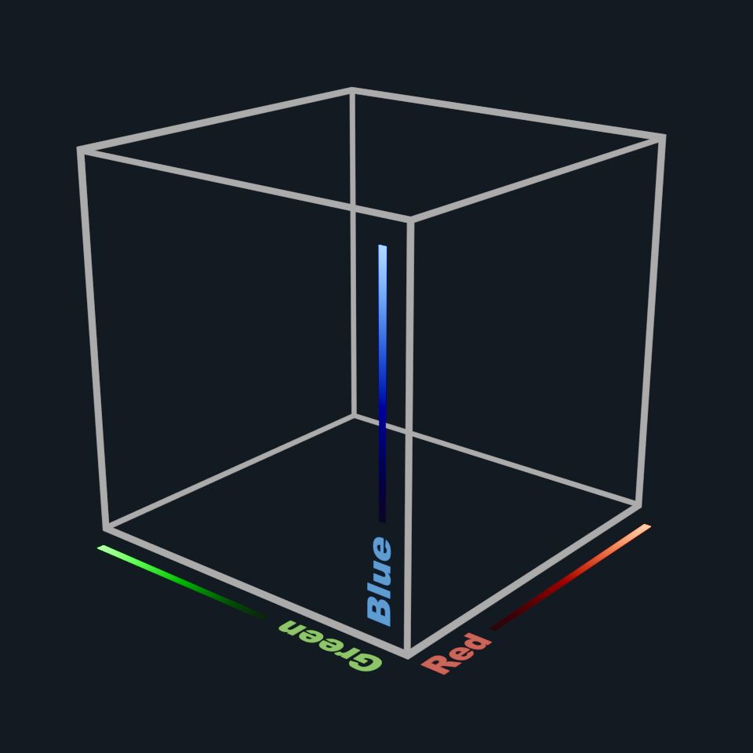

# 🎞️ flim - Filmic Color Transform

## Introduction

**flim is an experimental film emulation transform** that can be used for:

1. Displaying Digital Open-Domain (HDR) Images
2. Color Grading
3. Post-Processing in Video Games and Shaders ("tone-mapping")

flim comes with 2 presets, but you can add your own presets with their custom parameters!
  - **default**: The default preset provides a generic look that works well on most images.
  - **gold**: Gives a tastier, more dramatic look.

## Eye Candy

- See comparisons between native sRGB, [AgX](https://github.com/sobotka/SB2383-Configuration-Generation), and flim's presets in the [releases](https://github.com/bean-mhm/flim/releases) section.

- You can find links to collections of OpenEXR image files for testing in [Useful Links](#useful-links).

- Below are some example images gone through flim's gold preset (v0.6.1).


## Releases

Here's what each new release contains:

 - 3D LUTs for flim

 - An [OpenColorIO](https://opencolorio.org/) config containing [AgX](https://github.com/sobotka/SB2383-Configuration-Generation) and flim's presets as view transforms

 - Comparisons between flim and other view transforms

[See the latest release here.](https://github.com/bean-mhm/flim/releases)

## Using the Config

As mentioned above, each new release comes with a config containing flim and [AgX](https://github.com/sobotka/SB2383-Configuration-Generation). If your DCC software supports [OpenColorIO](https://opencolorio.org/) for color management, you should be able to use flim's config. In [Blender](https://www.blender.org/), for example, you can swap the contents of the `colormanagement` folder with the contents of the config you want to use, after making a backup of Blender's default config (the [Filmic](https://sobotka.github.io/filmic-blender/) config, made by the author of AgX, [Troy Sobotka](https://github.com/sobotka/)).

> `[Blender Installation Path]/X.X/datafiles/colormanagement`

I recommend you take a look at the [Filmic](https://sobotka.github.io/filmic-blender/) config, even if you don't use Blender. [Troy](https://github.com/sobotka/) is a very respectful and experienced person in this area, and I've learned a lot from him, even while making flim. Feel free to also check out their [IMDb](https://www.imdb.com/name/nm0811888/) page, and their blog, [The Hitchhiker's Guide to Digital Colour](https://hg2dc.com/).

## Scripts

The code is structured in the following way:

| Script | Role | Uses |
|---|---|---|
| main.py | Compiles 3D LUTs for flim | flim.py  |
| flim.py | Transforms a given linear 3D LUT table | utils.py |
| utils.py | Contains helper functions | - |

You can add new presets in `main.py`, or play with the film emulation chain in `flim.py`.

Here are the external libraries required to run the scripts:

 - [Colour](https://www.colour-science.org/)
 
 - [NumPy](https://numpy.org/)
 
 - [Joblib](https://joblib.readthedocs.io/en/latest)

## Using the LUTs

First, a few notes:

 - flim's 3D LUTs are designed to be used in an [OpenColorIO](https://opencolorio.org/) (OCIO) environment, but depending on your software and environment, you might be able to manually replicate the transforms in your custom pipeline ([See Non-OCIO Guide below](#non-ocio-guide)).
 
 - flim only supports the sRGB display format as of now.

If `main.py` runs successfully, you should see files named like `flim_X.spi3d` in the same directory. Alternatively, you can look up the latest LUTs in the [releases](https://github.com/bean-mhm/flim/releases) section.

The LUT comments contain most of the information you need. The following is an example of the LUT comments (note that this might not match the latest version).

```
# -------------------------------------------------
# 
# flim v1.1.0 - Filmic Color Transform
# 
# Preset: default
# URL: None
# 
# LUT input is expected to be in Linear BT.709 I-D65 and gone through an AllocationTransform like the following:
# !<AllocationTransform> {allocation: lg2, vars: [-10, 10, 0.0009765625]}
# 
# Output will be in sRGB 2.2.
# 
# Here's how you can add this to an OpenColorIO config:
```
```yaml
colorspaces:
  - !<ColorSpace>
    name: flim (default)
    family: Image Formation
    equalitygroup: ""
    bitdepth: unknown
    description: flim v1.1.0 - https://github.com/bean-mhm/flim
    isdata: false
    allocation: uniform
    from_scene_reference: !<GroupTransform>
      children:
        - !<ColorSpaceTransform> {src: reference, dst: Linear BT.709 I-D65}
        - !<RangeTransform> {min_in_value: 0., min_out_value: 0.}
        - !<AllocationTransform> {allocation: lg2, vars: [-10, 10, 0.0009765625]}
        - !<FileTransform> {src: flim_default.spi3d, interpolation: linear}
```
```
# Explanation:
#   1. ColorSpaceTransform converts the input from the scene reference to Linear BT.709 I-D65. If this is named
#      differently in your config (for example Linear Rec.709), change the name manually.
#   2. RangeTransform clips negative values. You might want to use a gamut compression algorithm before this step.
#   3. AllocationTransform is for LUT compression, it takes the log2 of the RGB values and maps them from a
#      specified range (the first two values after 'vars') to [0, 1]. The third value is the offset applied to the
#      values before log2. This is done to keep the blacks.
#   4. Lastly, the FileTransform references the 3D LUT and defines a trilinear interpolation method.
# 
# Adding this as a view transform is pretty straightforward:
```
```yaml
displays:
  sRGB:
    - !<View> {name: flim (default), colorspace: flim (default)}
    ... (other view transforms here)
```
```
# 
# Repo:
# https://github.com/bean-mhm/flim
# 
# Read more:
# https://opencolorio.readthedocs.io/en/latest/guides/authoring/authoring.html#how-to-configure-colorspace-allocation
# 
# -------------------------------------------------
```

### Non-OCIO Guide

You can replicate the transforms fairly easily in order to use flim's 3D LUTs in your own pipeline without OCIO. The following pseudo-code demonstrates the general process to transform a single RGB triplet (note that this might not match the latest version).

```py
# Input RGB values (color space: Linear BT.709 I-D65)
col = np.array([4.2, 0.23, 0.05])

# RangeTransform
# Clip negative values, or use a gamut compression algorithm.
col = np.maximum(col, 0.0)

# AllocationTransform
col += 0.000244140625  # offset by 2 to the power of -12 (lower bound of log2 compression)
col = np.log2(col)
col = map_range(col, from=[-12, 10], to=[0, 1], clamp=True)

# Sample from the 3D LUT (output color space: sRGB 2.2)
out = lut.sample(TRILINEAR, col)
```



## Useful Links

- [The Hitchhiker's Guide to Digital Colour - Troy Sobotka](https://hg2dc.com/)
- [CG Cinematography - Christophe Brejon](https://chrisbrejon.com/cg-cinematography/)
- [RealBloom, Physically Accurate Bloom Simulation - Me](https://github.com/bean-mhm/realbloom)
- [AgX Config Generator - Troy Sobotka](https://github.com/sobotka/SB2383-Configuration-Generation)
- [Test Image Collection 1 - Troy Sobotka](https://github.com/sobotka/Testing_Imagery)
- [Test Image Collection 2 - Troy Sobotka](https://github.com/sobotka/images)
- [PolyHaven, HDRIs](https://polyhaven.com/hdris)
