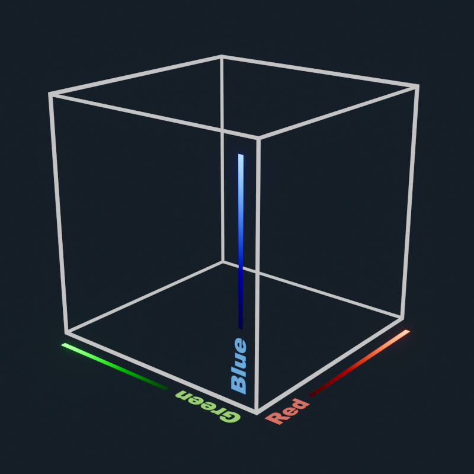

<div align="center">
<a href='https://ko-fi.com/E1E81LFRKY' target='_blank'></a>
</div>


 # 🎞️ flim - Filmic Color Transform

**flim (stylized as lowercase) is a film emulation transform** that can be used for:

1. Display-View Transforms in 3D Rendering and Video Editing
2. Mapping Linear Open-Domain (HDR) Images to the 0-1 Range
3. Color Grading
4. Post-Processing in Video Games and Shaders ("tone-mapping")

flim comes with 3 presets, but you can add your own in `main.py`!
  - **default**: The default preset provides a generic look that works well on most images.
  - **nostalgia**: A more alive and vibrant look.
  - **silver**: A more dramatic look.

## [Watch my video on YouTube about how flim works!](https://www.youtube.com/watch?v=okPzA04TLYM)

# grace

[grace](https://github.com/bean-mhm/grace) is a modified version of
[Blender 5.0's](https://www.blender.org/) default
[OpenColorIO](https://opencolorio.org/)
config that adds [flim](https://github.com/bean-mhm/flim) as a view transform.
**I suggest you use grace instead of the test OCIO config that comes with flim's releases.**

# Eye Candy

- See comparisons between native sRGB, AgX, and flim's presets in the [releases](https://github.com/bean-mhm/flim/releases) section.

- You can find links to collections of OpenEXR image files for testing in [Useful Links](#useful-links).

- Below are some example images gone through flim's different presets.
- 


# Releases

Here's what each new release contains:

 - 3D LUTs for flim

 - An [OpenColorIO](https://opencolorio.org/) config containing AgX and flim's presets as view transforms

 - Comparisons between flim and other view transforms

[See the latest release here.](https://github.com/bean-mhm/flim/releases)

# Using the Config

If your DCC software supports [OpenColorIO](https://opencolorio.org/) for color management, look up how you can switch the OCIO config. In [Blender](https://www.blender.org/), for example, you can swap the contents of the `colormanagement` folder with the contents of the config you want to use, after making a backup of Blender's default config.

> `[Blender Installation Path]/X.X/datafiles/colormanagement`

> [!NOTE]
> The OCIO configs that come with flim's releases are test configs. If you want
> a better experience, use [grace](https://github.com/bean-mhm/grace).

# Scripts

The code is structured in the following way:

| Script | Role | Uses |
|---|---|---|
| main.py | Compiles 3D LUTs for flim | flim.py  |
| flim.py | Transforms a given linear 3D LUT table | utils.py |
| utils.py | Contains helper functions | super_sigmoid.py |
| super_sigmoid.py | A custom sigmoid function | - |

You can add new presets in `main.py`, or play with the film emulation chain in `flim.py`.

Here are the external libraries required to run the scripts:

 - [Colour](https://www.colour-science.org/)
 
 - [NumPy](https://numpy.org/)
 
 - [Joblib](https://joblib.readthedocs.io/en/latest)

# Using the LUTs

First, a few notes:

 - flim's 3D LUTs are designed to be used in an [OpenColorIO](https://opencolorio.org/) (OCIO) environment, but depending on your software and environment, you might be able to manually replicate the transforms in your custom pipeline ([See Non-OCIO Guide below](#non-ocio-guide)).
 
 - flim only has presets for the sRGB display format as of now. If you want to
 add a preset that works in another color space, make sure you're using a display
 device that supports that color space. You can then tweak and find acceptable
 parameters.

# Adding flim to a your OCIO config

If you want to add flim to your own custom OCIO config, follow these instructions.

If `main.py` runs successfully, you should see files named like `flim_X.spi3d` in the same directory. Alternatively, you can look up the latest LUTs in the [releases](https://github.com/bean-mhm/flim/releases) section.

The LUTs contain comments that explaining how to add them to an OCIO config. The following is an example of the LUT comments (note that this might not match the latest version).

```
# -------------------------------------------------
# 
# flim v1.2.0 - Filmic Color Transform
# 
# Preset: default
# URL: None
# 
# LUT input is expected to be in Linear BT.709 I-D65 and gone through an AllocationTransform like the following:
# !<AllocationTransform> {allocation: lg2, vars: [-10, 10, 0.0009765625]}
# 
# Output will be in sRGB.
# 
# Here's how you can add this to an OpenColorIO config:
```
```yaml
colorspaces:
  - !<ColorSpace>
    name: flim (default)
    family: Image Formation
    equalitygroup: ""
    bitdepth: unknown
    description: flim v1.1.0 - https://github.com/bean-mhm/flim
    isdata: false
    allocation: uniform
    from_scene_reference: !<GroupTransform>
      children:
        - !<ColorSpaceTransform> {src: reference, dst: Linear BT.709 I-D65}
        - !<RangeTransform> {min_in_value: 0., min_out_value: 0.}
        - !<AllocationTransform> {allocation: lg2, vars: [-10, 10, 0.0009765625]}
        - !<FileTransform> {src: flim_default.spi3d, interpolation: linear}
```
```
# Explanation:
#   1. ColorSpaceTransform converts the input from the scene reference to Linear BT.709 I-D65. If this is named
#      differently in your config (for example Linear Rec.709), change the name manually.
#   2. RangeTransform clips negative values. You might want to use a gamut compression algorithm before this step.
#   3. AllocationTransform is for LUT compression, it takes the log2 of the RGB values and maps them from a
#      specified range (the first two values after 'vars') to [0, 1]. The third value is the offset applied to the
#      values before log2. This is done to keep the blacks.
#   4. Lastly, the FileTransform references the 3D LUT and defines a trilinear interpolation method.
# 
# Adding this as a view transform is pretty straightforward:
```
```yaml
displays:
  sRGB:
    - !<View> {name: flim (default), colorspace: flim (default)}
    ... (other view transforms here)
```
```
# 
# Repo:
# https://github.com/bean-mhm/flim
# 
# Read more:
# https://opencolorio.readthedocs.io/en/latest/guides/authoring/authoring.html#how-to-configure-colorspace-allocation
# 
# -------------------------------------------------
```

## Non-OCIO Guide

After reading the explanations above, you should be able to replicate the transforms fairly easily in order to use flim's 3D LUTs in your own pipeline without OCIO. The following pseudo-code demonstrates the general process to transform a single RGB triplet (note that this might not match the latest version).

```py
# input RGB values (color space: Linear BT.709 I-D65)
col = np.array([4.2, 0.23, 0.05])

# RangeTransform
# Clip negative values, or use a gamut compression algorithm.
col = np.maximum(col, 0.0)

# AllocationTransform
col += 0.0009765625  # offset by 2 to the power of -10 (lower bound of log2 compression)
col = np.log2(col)
col = map_range(col, from=[-10, 10], to=[0, 1], clamp=True)

# sample from the 3D LUT (output color space: sRGB)
out = lut.sample(TRILINEAR, col)
```



# LUT Compression

As you saw above, flim uses logarithmic compression to fit an extremely large range of linear values without losing too much precision. The method is very simple. You take the log2 of your RGB values and map them from a large range (for example [-10, +10]) to the [0, 1] range. You can also add a tiny offset to the RGB values before taking the log2, in order to preserve tiny values all the way down to 0.

# Shadertoy

I made a GLSL port of flim on Shadertoy, [check it out here!](https://www.shadertoy.com/view/dd2yDz)


# Useful Links

- [The Hitchhiker's Guide to Digital Colour - Troy Sobotka](https://hg2dc.com/)
- [CG Cinematography - Christophe Brejon](https://chrisbrejon.com/cg-cinematography/)
- [RealBloom, Physically Accurate Bloom Simulation - Me](https://github.com/bean-mhm/realbloom)
- [Old AgX Config Generator - Troy Sobotka](https://github.com/sobotka/SB2383-Configuration-Generation)
- [Test Image Collection 1 - Troy Sobotka](https://github.com/sobotka/Testing_Imagery)
- [Test Image Collection 2 - Troy Sobotka](https://github.com/sobotka/images)
- [PolyHaven, HDRIs](https://polyhaven.com/hdris)
